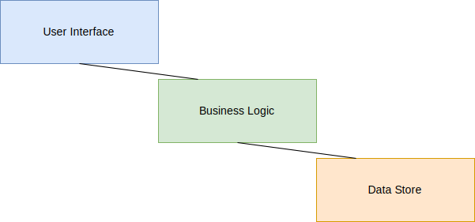

# System Architecture

## Overview

The system follows a modular architecture with clear separation of concerns.

## System Diagram

The following diagram illustrates the high-level system architecture:

## Components

The system consists of the following major components:

1. **User Interface** - Provides user interaction capabilities
2. **Business Logic** - Implements core functionality
3. **Data Store** - Manages persistent data
